# Compile PCL 1.11.1 - Ubuntu 20.04.2 LTS
This is a tutorial of how to compile and use Point Cloud Library (PCL) version 1.11.1 on Ubuntu 20.04.2 LTS. No need it to install!

Table of contents
=================

<!--ts-->
   * [Requirements](#Requirements)
      * [Boost](#boost)
      * [Eigen](#eigen)
      * [FLANN](#Compiling-FLANN)
      * [VTK](#Compiling-vtk)
   * [Installation](#Installation)
   * [Test](#Test)
<!--te-->

## Requirements
- Boost: Used for shared pointers, and threading.
- Eigen: Used as the matrix backend for SSE optimized math
- FLANN: Used in Kdtree for fast approximate nearest neighbors search
- VTK: Used in visualization for 3D point cloud, rendering and visualization.

## Compiling FLANN
Use the `master` version of flann from the repo instead of an official released.
1. Download FLANN source code in `/opt`: [FLANN](https://github.com/flann-lib/flann) 
2. Edit `CMakeLists.txt` on `flann/src/cpp/CMakeLists.txt` and replace line 32 and 86:

`add_library(flann_cpp SHARED "") -> add_library(flann_cpp SHARED "main.cpp")`

2. Create a `main.cpp` file at the same directory
3. Compile and install FLANN:
```
$ cd build/
$ sudo cmake-gui ../
$ sudo make -j4
$ sudo make install
```

## Compiling VTK
1. Download VTK 8.1/8.2 source code in `/opt`: [VTK](https://github.com/Kitware/VTK)
2. Create a `build` directory
3. Run CMake-gui:
```
$ cd build/
$ sudo cmake-gui ../
```
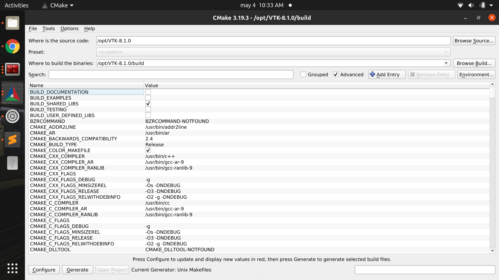<br>
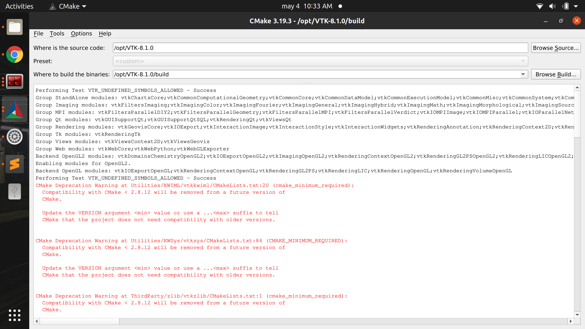<br>
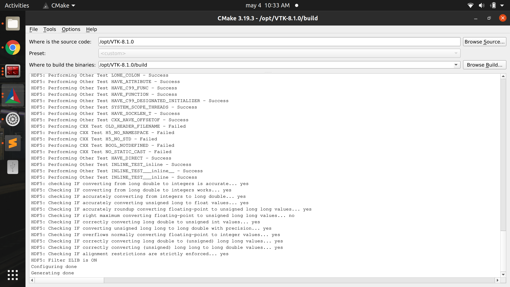<br>

4. Compile and install VTK:
```
$ sudo make -j4
$ sudo make install
```
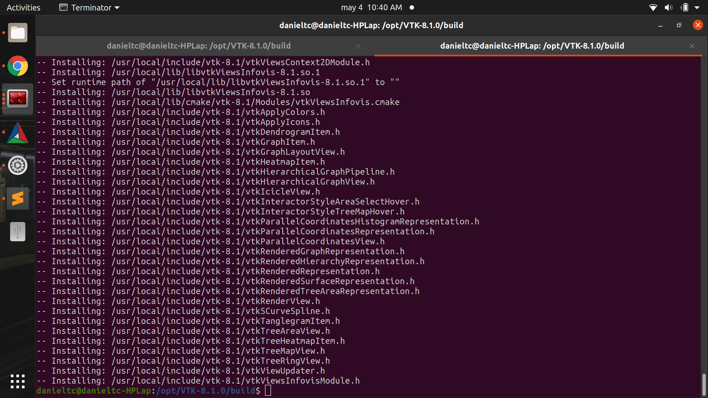<br>

## Installation
1. Download source code in `/opt`: [PCL](https://github.com/PointCloudLibrary/pcl)
2. Create a `build` directory
3. Create build files:
```
$ cd build/
$ sudo cmake-gui ../
```
4. Select/Unselect pcl modules

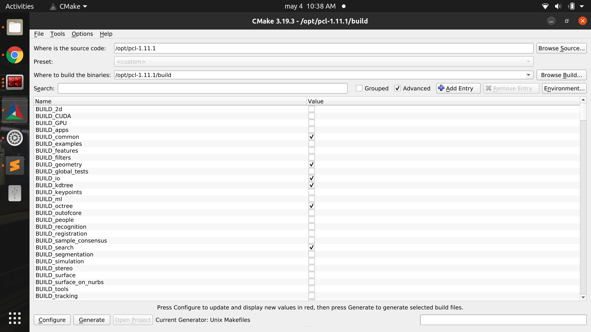<br>
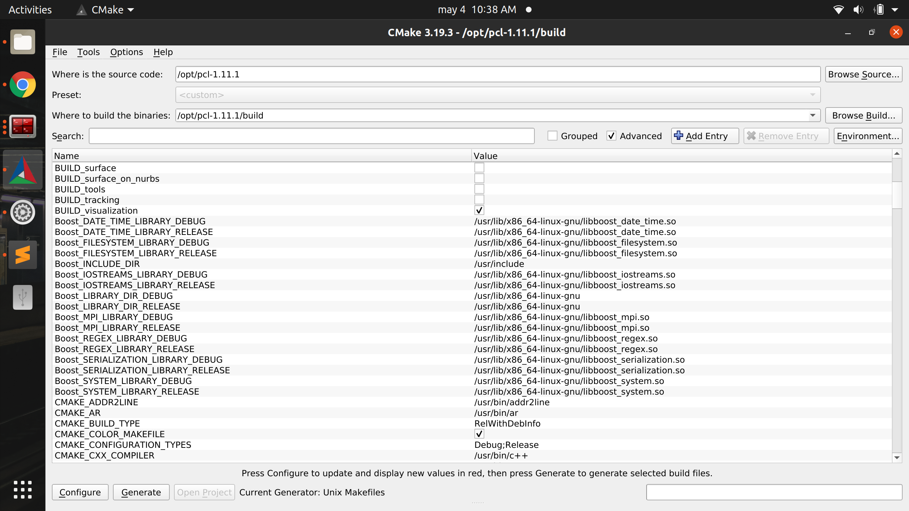<br>
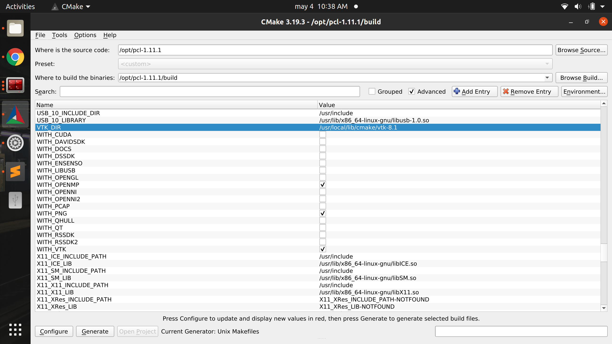<br>

6. Compile PCL
```
$ sudo make -j4
```
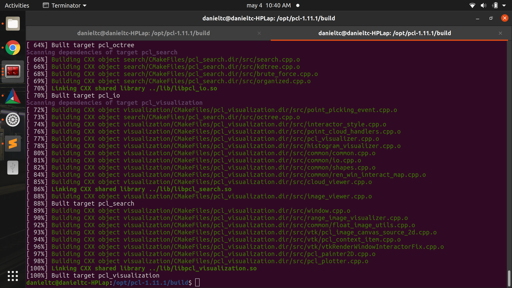<br>

## Test 
1. Download sample PCL code: [pcl visualizer](https://github.com/danielTobon43/pcl_visualizer)
2. Create a `build` directory
3. Set PCL build directory in `CMakeLists.txt` in the `/src` folder, line 20.

```
# set corresponding package directories
set(PCL_DIR /opt/pcl-1.11.1/build)
```
4. Define CXX14 standard (optional)
```
set(CMAKE_CXX_STANDARD 14)
set(CMAKE_CXX_STANDARD_REQUIRED ON)
```
5. Define common io visualization module (optional)
```
find_package(PCL 1.9 PATHS ${PCL_DIR} QUIET REQUIRED COMPONENTS common io visualization) 
```
6. Create build files:
```
$ cd build/
$ cmake ../src/
```
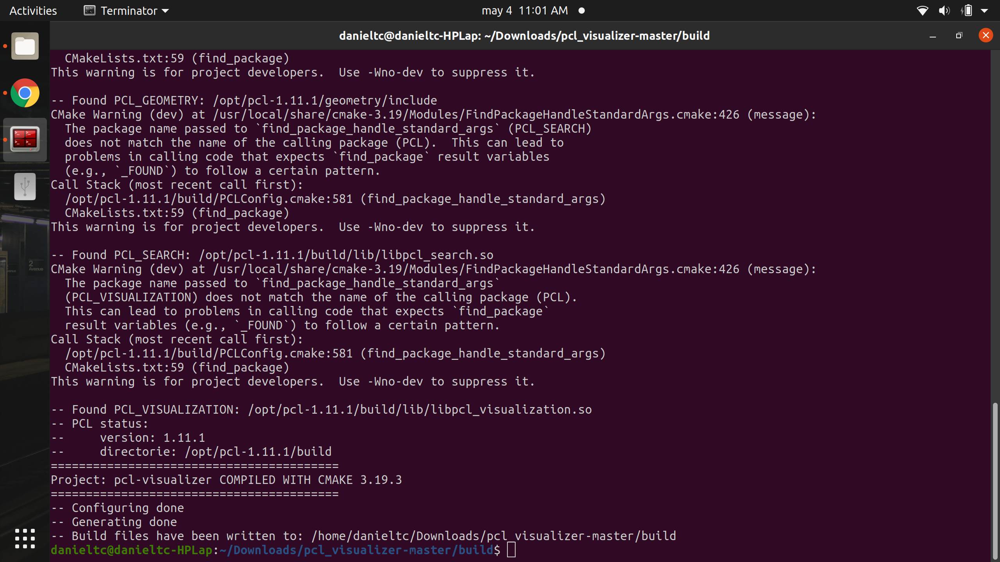<br>

7. Compile sample code:
```
$ make
```
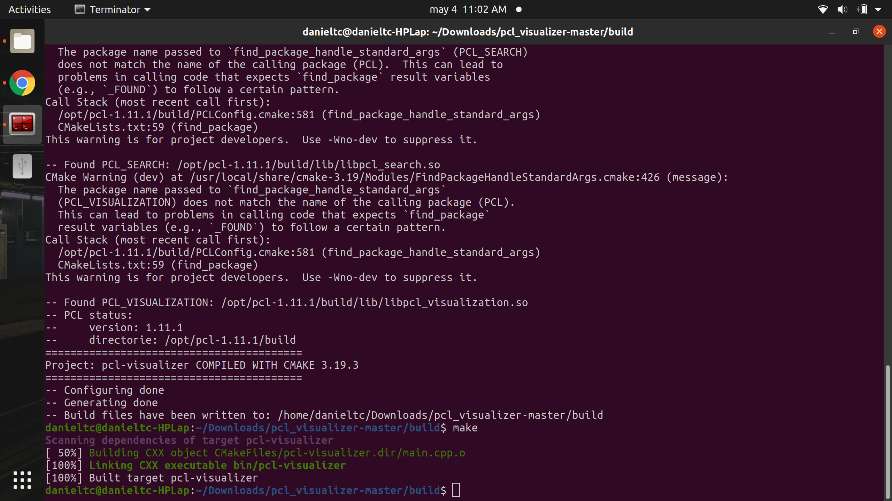<br>

7. Download .pcd sample file: [PCD file](https://drive.google.com/drive/folders/1sW4oqcaKPsupEaSFkoGAgdHjv6ydwUFF?usp=sharing)
8. Test bin file
```
$ cd bin/
$ ./pcl-visualizer <.pcd file>
```
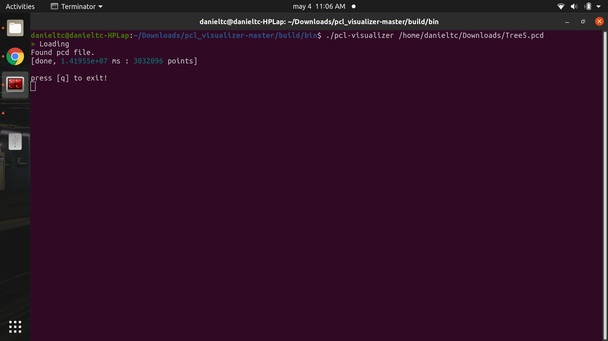<br>

## Result
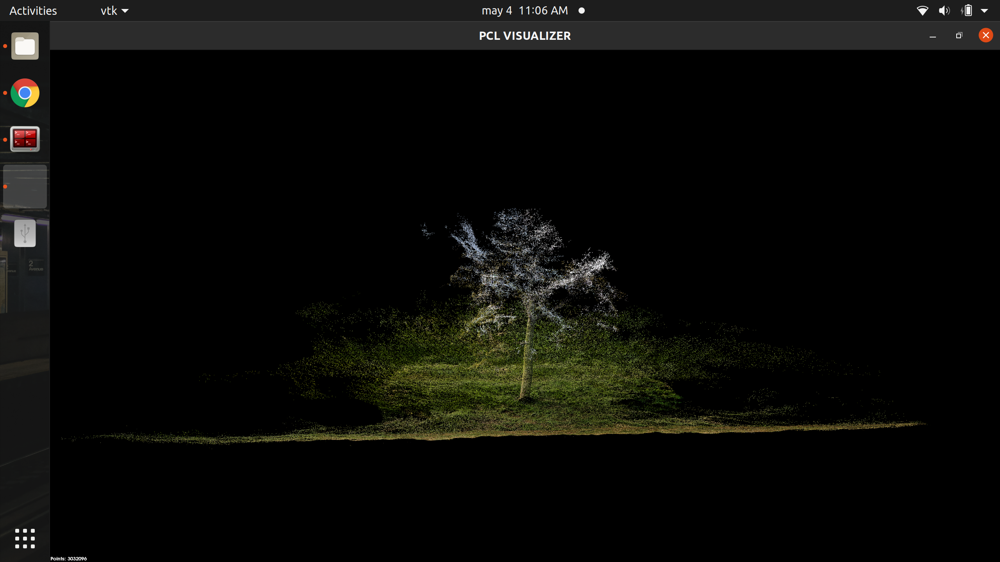<br>

## Troubleshooting 
- Issue: `Error while loading shared libraries: cannot open shared object file: No such file or directory`
- Solution: `$ sudo ldconfig -v`  [ref](https://github.com/CogChameleon/ChromaTag/issues/2)

- Issue: `undefined reference to 'LZ4_decompress_safe'`
- Solution: Use the `master` version of flann from the official repository

- Issue: `error: ‘Octree2BufBase’ does not name a type pcl`
- Solution: Instead of PCL 1.11.1 released use PCL 1.9.1
